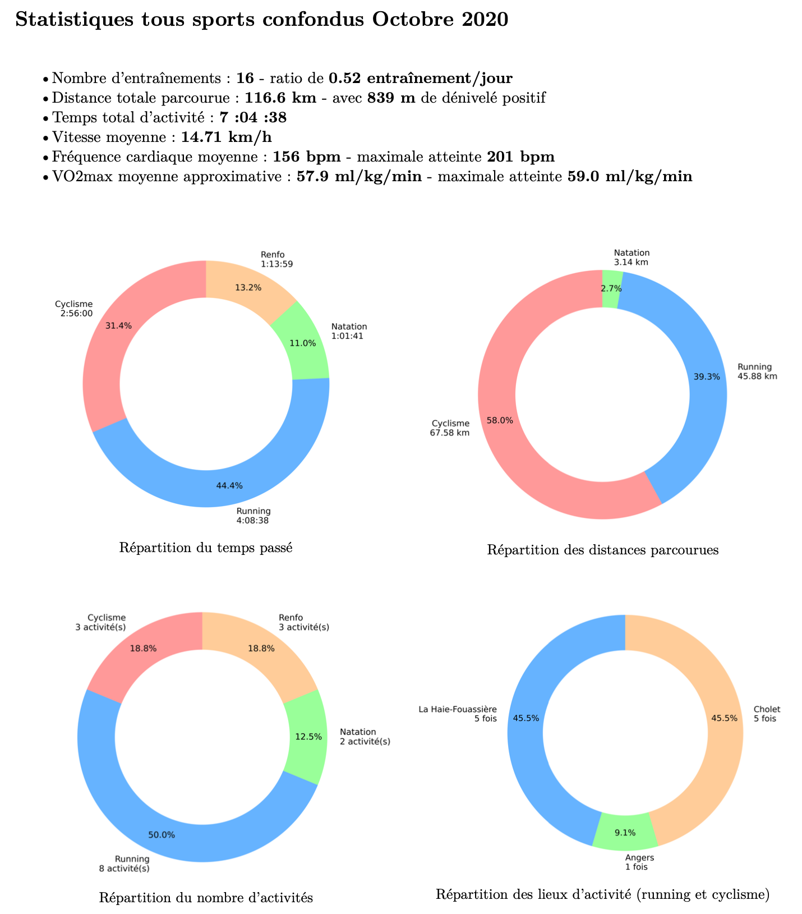

# Triathlon-pystats

L'objectif du programme est de générer des PDF contenant des statistiques
écrites, et sous formes de graphiques. Il est possible de générer des PDF
pour des périodes mensuelles et anuelles. La période "tous les temps" est
prévue.

Exemple du rendu PDF :



## Fonctionnement

La réalisation de statistiques se base sur un fichier "activities.csv",
obtenu à partir de l'API Garmin Connect (Polar non compatible). Pour
obtenir le fichier, le programme utilise
[garmin-connect-export](https://github.com/pe-st/garmin-connect-export)
disponible sur Github.

**Commandes pour générer les PDF** :

* Télécharger les activités et générer un PDF

```bash
python triathlon-pystats.py --mail-garmin <mail_garmin_connect@mail.com> --date 2020
python triathlon-pystats.py -m <mail_garmin_connect@mail.com> -d 2020
```

* Générer un rapport PDF sans télécharger les activités (Les activités doivent
avoir été téléchargées au préalable)

```bash
python triathlon-pystats.py -d 2020
```

* Afficher l'aide

```bash
python triathlon-pystats.py --help
```

Les formats de date disponibles sont : "YYYY", "YYYY-MM", "YYYY-MM-DD", "all-time".

## Informations

* Version python : 3.8
* Génération des PDF basée sur [LaTeX](https://www.latex-project.org)
* Génération des graphiques basée sur [Matplotlib](https://matplotlib.org)
* Développé sous Linux Fedora 33 et macOS 11.X, non testé sur Windows 10

**Dépendances pip à installer** :

* [matplotlib](https://pypi.org/project/matplotlib)
* [gitpython](https://pypi.org/project/GitPython)
* [pandas](https://pypi.org/project/pandas)

Les développements de l'outil sont faits sans réflexion au préalable,
le code n'est pas optimisé et peut ne pas toujours être très clair.

## Bugs connus

* Dossier non présent la première fois

## Idées d'améliorations

* Faire des graphiques pour montrer des évolutions sur plusieurs mois